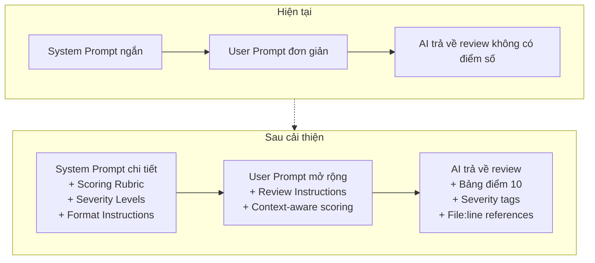
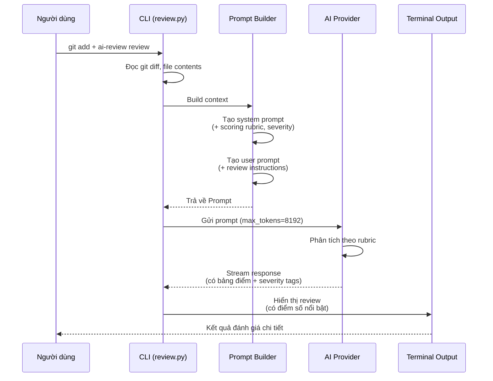

# 🎯 Kế hoạch Cải thiện Prompt & Scoring cho AI-Review

> **Mục tiêu:** Nâng cấp prompt đầu vào và định dạng đầu ra để đánh giá mã nguồn chi tiết, chính xác hơn, có thang điểm 10 rõ ràng.

---

## 📊 Đánh giá hiện tại: 5.5 / 10

| Tiêu chí | Điểm | Lý do |
|----------|:----:|-------|
| Cấu trúc phân loại | 7/10 | Có 6 mục rõ ràng nhưng thiếu chiều sâu |
| Scoring rubric | 2/10 | Không có thang điểm, không có trọng số |
| Phân loại mức độ | 1/10 | Không phân biệt Critical/Major/Minor |
| Hướng dẫn chi tiết | 5/10 | Quá ngắn, thiếu ví dụ cụ thể |
| File reference | 3/10 | Không yêu cầu AI chỉ đường dẫn file/dòng |
| max_tokens | 6/10 | 4096 tokens — đủ cho review cơ bản nhưng không đủ cho review chi tiết + scoring |
| Default rules | 5/10 | 5 dòng chung chung, thiếu tiêu chí cụ thể |

---

## 🗺️ Kiến trúc thay đổi



---

## 📋 Danh sách công việc chi tiết

### 1. Cải thiện System Prompt — [`src/ai/prompt_builder.py`](src/ai/prompt_builder.py:9)

#### 1a. Thêm Scoring Rubric (thang 10)

```python
## Thang điểm Đánh giá (tổng: 10)

Sau khi phân tích, bạn PHẢI chấm điểm tổng thể theo thang 10:

| Tiêu chí | Trọng số | Mô tả |
|----------|----------|-------|
| 🐛 Tính đúng đắn | 3.0 | Không có lỗi logic, bug, edge case không xử lý |
| 🔒 Bảo mật | 2.0 | Không có lỗ hổng, exposed secrets, injection risks |
| ⚡ Hiệu suất | 1.5 | Code hiệu quả, không lãng phí tài nguyên |
| 🎨 Chất lượng mã | 2.0 | Dễ đọc, đặt tên tốt, cấu trúc hợp lý |
| 📚 Bảo trì | 1.5 | Dễ mở rộng, testable, có documentation |

Cách tính: Tổng điểm = Σ(điểm_tiêu_chí × trọng_số) / 10
```

#### 1b. Thêm Severity Levels

```python
## Phân loại Mức độ Nghiêm trọng

Mỗi vấn đề PHẢI được gắn nhãn:
- 🔴 **Critical** — Crash, mất dữ liệu, lỗ hổng bảo mật
- 🟠 **Major** — Logic sai, hiệu năng kém nghiêm trọng
- 🟡 **Minor** — Vi phạm convention, code khó đọc
- 🔵 **Info** — Gợi ý cải tiến, best practice
```

#### 1c. Thêm Format Requirements

```python
## Quy tắc quan trọng
1. Luôn đưa ra điểm số cụ thể — Không đánh giá chung chung
2. Mỗi vấn đề phải có mức độ nghiêm trọng — Dùng emoji 🔴🟠🟡🔵
3. Mỗi vấn đề phải kèm file & dòng code — `path/to/file.py:42`
4. Ưu tiên các vấn đề Critical/Major
5. Sử dụng ví dụ mã khi minh họa cách sửa lỗi
```

### 2. Cải thiện User Prompt — [`src/ai/prompt_builder.py`](src/ai/prompt_builder.py:94)

#### 2a. Thêm section `_build_review_instructions()`

```python
def _build_review_instructions(ctx: ReviewContext) -> str:
    return f"""## Yêu cầu Đánh giá

Vui lòng đánh giá changeset này:

1. Chấm điểm tổng thể trên thang 10 (theo rubric)
2. Liệt kê tất cả vấn đề, kèm:
   - Mức độ nghiêm trọng (🔴🟠🟡🔵)
   - Đường dẫn file & số dòng chính xác
   - Giải thích ngắn gọn
   - Đề xuất cách khắc phục
3. Đưa ra bảng điểm chi tiết cho từng tiêu chí

### Ngữ cảnh
- Project: {ctx.project_info.name}
- Branch: {ctx.branch}
- Số file thay đổi: {len(ctx.changed_files)}
- Loại thay đổi: {', '.join(set(f.status for f in ctx.changed_files))}
"""
```

#### 2b. Cập nhật `_build_user_prompt()` để include instructions mới

```python
def _build_user_prompt(ctx: ReviewContext) -> str:
    sections = [
        _build_project_context(ctx),
        _build_commit_context(ctx),
        _build_changed_files_section(ctx),
        _build_diff_section(ctx.diff),
        _build_file_contents_section(ctx),
        _build_review_instructions(ctx),  # ← MỚI
    ]
    return "\n\n".join(s for s in sections if s)
```

### 3. Tăng max_tokens — [`src/config.py`](src/config.py:24)

```python
# Thay đổi:
max_tokens=int(os.getenv("AI_MAX_TOKENS", "4096")),
# Thành:
max_tokens=int(os.getenv("AI_MAX_TOKENS", "8192")),
```

Lý do: Review chi tiết + bảng điểm + giải thích từng tiêu chí cần nhiều tokens hơn.

### 4. Cải thiện Default Rules — [`src/rules/__init__.py`](src/rules/__init__.py:7)

Mở rộng từ 5 dòng lên ~25 dòng với các tiêu chí cụ thể cho từng khía cạnh:

```python
DEFAULT_RULES = """
## Default Review Rules

### 1. Tính đúng đắn (Correctness)
- Kiểm tra lỗi logic, off-by-one, null pointer, race condition
- Xác minh xử lý edge cases (empty input, boundary values, exceptions)
- Kiểm tra type safety và type hints nhất quán

### 2. Bảo mật (Security)
- Phát hiện hardcoded secrets, API keys, passwords
- Kiểm tra SQL injection, command injection, path traversal
- Rà soát authentication/authorization logic
- Kiểm tra input validation và sanitization

### 3. Hiệu suất (Performance)
- Phát hiện N+1 queries, vòng lặp không cần thiết
- Kiểm tra sử dụng bộ nhớ, memory leaks
- Rà soát I/O operations không cần async/await
- Kiểm tra caching opportunities

### 4. Chất lượng mã (Code Quality)
- Đặt tên biến/hàm/class rõ ràng, có ý nghĩa
- Tuân thủ DRY, SOLID principles
- Kiểm tra độ phức tạp (cyclomatic complexity)
- Rà soát error handling (try/catch phù hợp)
- Kiểm tra unit test coverage cho logic mới

### 5. Khả năng bảo trì (Maintainability)
- Code dễ đọc, có comment khi cần
- Cấu trúc module hợp lý, ít dependency vòng
- Có documentation cho public APIs
- Tuân thủ project conventions
"""
```

### 5. Cập nhật kiểu dữ liệu — [`src/types.py`](src/types.py)

Thêm các trường mới nếu cần (tùy chọn, có thể implement sau):

```python
@dataclass
class ReviewScore:
    correctness: float  # 0-10
    security: float     # 0-10
    performance: float  # 0-10
    quality: float      # 0-10
    maintainability: float  # 0-10
    total: float        # 0-10 (weighted)

@dataclass
class ReviewResult:
    content: str
    model: str
    tokens_used: Optional[int] = None
    score: Optional[ReviewScore] = None  # ← MỚI (optional, có thể parse từ response)
```

### 6. Cập nhật terminal output — [`src/utils/terminal.py`](src/utils/terminal.py)

Cải thiện hiển thị để làm nổi bật điểm số:

```python
def print_review(content: str, model: str) -> None:
    """Render the AI review as beautifully formatted Markdown inside a panel."""
    console.print()
    console.print(
        Panel(
            Markdown(content),
            title=f"[bold blue]AI Code Review[/bold blue]",
            subtitle=f"[dim]Model: {model}[/dim]",
            border_style="blue",
            padding=(1, 2),
        )
    )
    console.print()
```

*(Phần này có thể giữ nguyên hoặc cải thiện thêm sau)*

---

## 📈 Dự kiến kết quả sau cải thiện

| Tiêu chí | Trước (5.5/10) | Sau (dự kiến) |
|----------|:--------------:|:--------------:|
| **Scoring rubric** | ❌ Không có | ✅ Thang 10 với trọng số |
| **Severity levels** | ❌ Không có | ✅ Critical/Major/Minor/Info |
| **File:line reference** | ❌ Không yêu cầu | ✅ Bắt buộc |
| **Hướng dẫn chi tiết** | ⚠️ Sơ sài | ✅ Rõ ràng, có ví dụ |
| **max_tokens** | 4096 | 8192+ |
| **Default rules** | 5 dòng | 25+ dòng chi tiết |
| **Cấu trúc output** | 6 mục cơ bản | 7 mục + bảng điểm |

---

## 🔄 Luồng hoạt động mới



---

## 📁 Các file cần sửa đổi

| File | Thay đổi | Mức độ |
|------|----------|--------|
| [`src/ai/prompt_builder.py`](src/ai/prompt_builder.py:9) | Mở rộng system prompt + thêm review instructions | 🔴 Lớn |
| [`src/rules/__init__.py`](src/rules/__init__.py:7) | Mở rộng default rules chi tiết | 🟠 Vừa |
| [`src/config.py`](src/config.py:24) | Tăng max_tokens từ 4096 → 8192 | 🟢 Nhỏ |
| [`src/types.py`](src/types.py:49) | Thêm ReviewScore dataclass (tùy chọn) | 🟢 Nhỏ |

---

## ✅ Tiêu chí chấp nhận (Acceptance Criteria)

1. AI trả về **bảng điểm chi tiết** theo thang 10 với 5 tiêu chí có trọng số
2. Mỗi vấn đề được gắn **nhãn mức độ nghiêm trọng** (🔴🟠🟡🔵)
3. Mỗi vấn đề có **đường dẫn file và số dòng** cụ thể
4. Output có **tổng điểm tổng thể** (0-10)
5. max_tokens đủ lớn (8192) để không bị cắt giữa chừng
6. Default rules cung cấp **hướng dẫn chi tiết** cho AI
