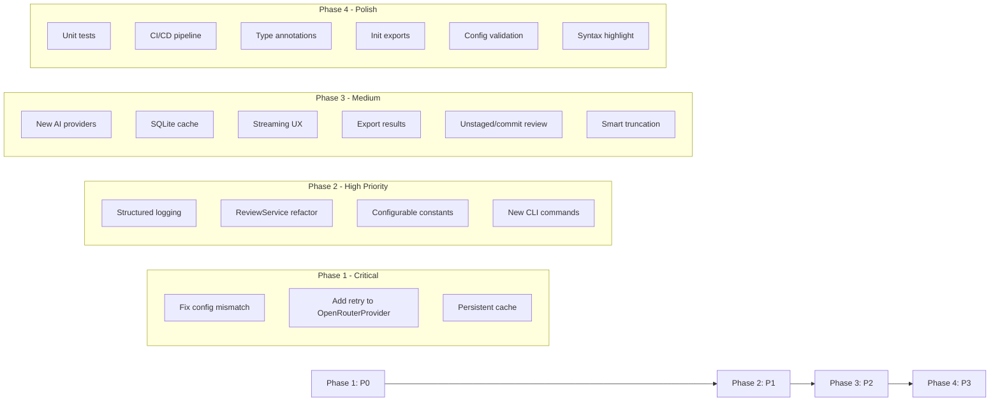

# 🚀 AI-Review Python — Kế hoạch Nâng cấp Theo Mức độ Ưu tiên

> Dựa trên phân tích mã nguồn [`ai-review-py`](pyproject.toml:1) — CLI đánh giá mã nguồn bằng AI cho git staged changes.

---

## 🏆 Mức độ Ưu tiên

| Mức | Ý nghĩa |
|-----|---------|
| 🔴 **P0 — Critical** | Lỗi chức năng, bảo mật, hoặc thiếu tính năng cốt lõi |
| 🟠 **P1 — High** | Cải thiện kiến trúc, UX, hiệu suất đáng kể |
| 🟡 **P2 — Medium** | Chất lượng mã, khả năng bảo trì, công thêm tính năng |
| 🟢 **P3 — Low** | Tối ưu nhỏ, docs, refactor cosmetic |

---

## 🔴 P0 — Critical (Phải làm ngay)

### 1. Sửa lỗi cấu hình không đồng bộ giữa README, `.env.example` và [`config.py`](src/config.py:6)

**Vấn đề:** [`README.md`](README.md:32) mô tả biến `OPENROUTER_API_KEY` nhưng [`config.py`](src/config.py:8) và [`.env.example`](.env.example:2) dùng `DEEPSEEK_API_KEY`. Gây nhầm lẫn nghiêm trọng cho người dùng mới.

**Giải pháp:**
- Đồng bộ README với tên biến thực tế (`DEEPSEEK_*`)
- Hoặc đổi tên biến thành trung lập (`AI_API_KEY`, `AI_MODEL`, `AI_BASE_URL`) và cập nhật cả config lẫn docs

### 2. Thêm `@retry` cho `OpenRouterProvider` — [`src/ai/providers.py`](src/ai/providers.py:135)

**Vấn đề:** `DeepSeekProvider` đã có `@retry` decorator (dòng 37) nhưng `OpenRouterProvider` thì chưa. Nếu OpenRouter bị rate limit hoặc lỗi tạm thời, sẽ fail ngay lập tức.

**Giải pháp:**
- Thêm `@retry(stop=stop_after_attempt(3), wait=wait_exponential(multiplier=1, min=2, max=10))` cho cả `ask()` và `stream()` của `OpenRouterProvider`
- Dùng `config.app_name` và `config.app_url` thay vì hardcode header `HTTP-Referer` và `X-Title`

### 3. Cache chỉ là in-memory, mất khi restart — [`src/cache.py`](src/cache.py:13)

**Vấn đề:** [`ReviewCache`](src/cache.py:13) lưu trong `dict` — mất sạch khi process kết thúc. Không có persistent cache.

**Giải pháp:**
- Thêm persistent cache tùy chọn (SQLite hoặc file JSON)
- Giữ in-memory cache làm primary, persistent làm secondary

---

## 🟠 P1 — High (Nên làm sớm)

### 4. Thêm structured logging thay vì print — toàn bộ project

**Vấn đề:** Toàn bộ code dùng `console.print` / Rich trực tiếp. Không có log level, không thể debug production.

**Giải pháp:**
- Tạo module [`src/utils/logger.py`](src/utils/__init__.py:1) với Python `logging` + Rich handler
- Các mức: DEBUG, INFO, WARNING, ERROR
- CLI flag `--verbose` để bật DEBUG log

### 5. Tách [`ReviewService`](src/commands/review.py:22) khỏi [`run_review`](src/commands/review.py:22)

**Vấn đề:** [`run_review`](src/commands/review.py:22) làm quá nhiều việc: git, file I/O, AI call, render. Vi phạm SRP.

**Giải pháp:**
- Tạo class `ReviewService` với các method riêng:
  - `check_git_repo()`
  - `collect_diff_and_files()`
  - `build_review_context()`
  - `execute_review()`
  - `handle_result()`
- [`run_review`](src/commands/review.py:22) chỉ là orchestrator gọi các method này

### 6. Cấu hình hóa các magic numbers — [`src/ai/prompt_builder.py`](src/ai/prompt_builder.py:73,88)

**Vấn đề:** `max_chars=12_000` và `6_000` là hardcoded.

**Giải pháp:**
- Đưa vào `AppConfig` hoặc constants module
- Cho phép override qua env var

### 7. Thêm CLI commands mở rộng — [`src/index.py`](src/index.py:12)

**Vấn đề:** Chỉ có 1 command `review`. Thiếu các tiện ích cơ bản.

**Giải pháp:**
- `ai-review init` — tạo `.env` + `.roo/rules.md` mẫu
- `ai-review config` — hiển thị cấu hình hiện tại
- `ai-review version` — hiển thị version

---

## 🟡 P2 — Medium (Có thể làm sau)

### 8. Thêm Provider mới: OpenAI, Anthropic, Google Gemini — [`src/ai/providers.py`](src/ai/providers.py:135)

**Vấn đề:** Chỉ hỗ trợ DeepSeek và OpenRouter.

**Giải pháp:**
- Implement `OpenAIProvider`, `AnthropicProvider`, `GeminiProvider`
- Mỗi provider trong file riêng: `src/ai/providers/openai.py`, v.v.
- Factory tự động detect provider từ config

### 9. Persistent cache với SQLite — [`src/cache.py`](src/cache.py:13)

**Vấn đề:** Cache mất khi restart.

**Giải pháp:**
- Thêm `SQLiteCache` kế thừa interface `CacheBackend`
- CLI flag `--cache-backend` (memory / sqlite)
- TTL tự động cleanup

### 10. Streaming output hoàn thiện — [`src/utils/terminal.py`](src/utils/terminal.py:42)

**Vấn đề:** [`stream_review`](src/utils/terminal.py:42) chỉ in chunk đơn giản, không có typing indicator hay progress.

**Giải pháp:**
- Thêm Rich `Live` display với spinner + accumulating content
- Hiển thị token count realtime nếu API trả về

### 11. Export kết quả review — [`src/commands/review.py`](src/commands/review.py:141)

**Vấn đề:** Kết quả chỉ hiển thị ra terminal, không lưu được.

**Giải pháp:**
- CLI flag `--output` / `-o` để export ra file (markdown, json, html)
- `--output-format` để chọn format

### 12. Hỗ trợ review unstaged changes + full diff

**Vấn đề:** Chỉ review staged changes (`git diff --cached`).

**Giải pháp:**
- CLI flag `--unstaged` để review working tree changes
- CLI flag `--commit <sha>` để review một commit cụ thể
- CLI flag `--branch <name>` để review diff giữa 2 branch

### 13. Cải thiện [`truncate_content`](src/utils/files.py:33) — không làm hỏng markdown

**Vấn đề:** [`truncate_content`](src/utils/files.py:33) thêm `# ... [truncated]` có thể phá vỡ cấu trúc code block.

**Giải pháp:**
- Detect nếu đang ở trong code block, đóng block trước khi truncate
- Thêm comment marker phù hợp với ngôn ngữ

---

## 🟢 P3 — Low (Tối ưu thêm)

### 14. Unit tests cho toàn bộ project

**Vấn đề:** Không có test nào.

**Giải pháp:**
- `pytest` với `pytest-asyncio`
- Mock git, file I/O, AI provider
- Test cache, prompt builder, config loader, git utils

### 15. CI/CD pipeline

**Vấn đề:** Không có GitHub Actions.

**Giải pháp:**
- `.github/workflows/ci.yml` — run tests + lint trên push/PR
- `.github/workflows/release.yml` — publish lên PyPI khi tag

### 16. Type annotations hoàn chỉnh

**Vấn đề:** Một số function thiếu return type annotation.

**Giải pháp:**
- Bổ sung `-> dict[str, Optional[str]]` cho [`read_files_concurrently`](src/utils/files.py:17)
- Bổ sung `-> str` cho [`resolve_project_name`](src/utils/files.py:52)

### 17. [`__init__.py`](src/commands/__init__.py:1) exports

**Vấn đề:** [`src/commands/__init__.py`](src/commands/__init__.py:1) và [`src/utils/__init__.py`](src/utils/__init__.py:1) trống.

**Giải pháp:**
- Export public API để import gọn hơn

### 18. Config validation schema

**Vấn đề:** [`load_config`](src/config.py:6) không validate kiểu dữ liệu (ví dụ `max_tokens` có thể là string rỗng → crash).

**Giải pháp:**
- Dùng `pydantic` hoặc `dataclass` validation
- Báo lỗi rõ ràng nếu config sai

### 19. Git diff highlight trong terminal output

**Vấn đề:** Diff hiển thị dạng text thô.

**Giải pháp:**
- Dùng Rich `Syntax` với lexer `diff` để highlight
- File contents highlight theo ngôn ngữ

---

## 📊 Tổng quan theo Module

| Module | P0 | P1 | P2 | P3 | Tổng |
|--------|----|----|----|----|------|
| [`src/config.py`](src/config.py:6) | 1 | — | — | 1 | 2 |
| [`src/ai/providers.py`](src/ai/providers.py:1) | 1 | — | 1 | — | 2 |
| [`src/ai/prompt_builder.py`](src/ai/prompt_builder.py:1) | — | 1 | — | — | 1 |
| [`src/cache.py`](src/cache.py:1) | 1 | — | 1 | — | 2 |
| [`src/commands/review.py`](src/commands/review.py:1) | — | 1 | 1 | — | 2 |
| [`src/index.py`](src/index.py:1) | — | 1 | — | — | 1 |
| [`src/utils/files.py`](src/utils/files.py:1) | — | — | 1 | 1 | 2 |
| [`src/utils/terminal.py`](src/utils/terminal.py:1) | — | — | 1 | 1 | 2 |
| [`src/utils/__init__.py`](src/utils/__init__.py:1) | — | 1 | — | 1 | 2 |
| [`src/git/index.py`](src/git/index.py:1) | — | — | 1 | — | 1 |
| Tests / CI | — | — | — | 2 | 2 |
| **Tổng** | **3** | **5** | **6** | **6** | **20** |

---

## 📋 Lộ trình triển khai đề xuất

---

## 🔗 File tham khảo chính

| File | Mục đích |
|------|----------|
| [`src/index.py`](src/index.py:1) | CLI entry point — cần mở rộng commands |
| [`src/config.py`](src/config.py:6) | Config loader — cần validation + đồng bộ |
| [`src/ai/__init__.py`](src/ai/__init__.py:1) | ✅ Provider factory — đã hoạt động đúng |
| [`src/ai/providers.py`](src/ai/providers.py:1) | AI providers — cần retry cho OpenRouter + new providers |
| [`src/ai/prompt_builder.py`](src/ai/prompt_builder.py:1) | Prompt assembly — cần configurable limits |
| [`src/cache.py`](src/cache.py:1) | Cache — cần persistent backend |
| [`src/commands/review.py`](src/commands/review.py:1) | Review orchestrator — cần tách SRP |
| [`src/utils/files.py`](src/utils/files.py:1) | File I/O — cần smart truncation |
| [`src/utils/terminal.py`](src/utils/terminal.py:1) | Terminal UI — cần streaming UX |
| File | Mục đích |
|------|----------|
| [`src/index.py`](src/index.py:1) | CLI entry point — cần mở rộng commands |
| [`src/config.py`](src/config.py:6) | Config loader — cần validation + đồng bộ |
| [`src/ai/__init__.py`](src/ai/__init__.py:1) | Provider factory — cần sửa dispatch |
| [`src/ai/providers.py`](src/ai/providers.py:1) | AI providers — cần retry + new providers |
| [`src/ai/prompt_builder.py`](src/ai/prompt_builder.py:1) | Prompt assembly — cần configurable limits |
| [`src/cache.py`](src/cache.py:1) | Cache — cần persistent backend |
| [`src/commands/review.py`](src/commands/review.py:1) | Review orchestrator — cần tách SRP |
| [`src/utils/files.py`](src/utils/files.py:1) | File I/O — cần smart truncation |
| [`src/utils/terminal.py`](src/utils/terminal.py:1) | Terminal UI — cần streaming UX |
