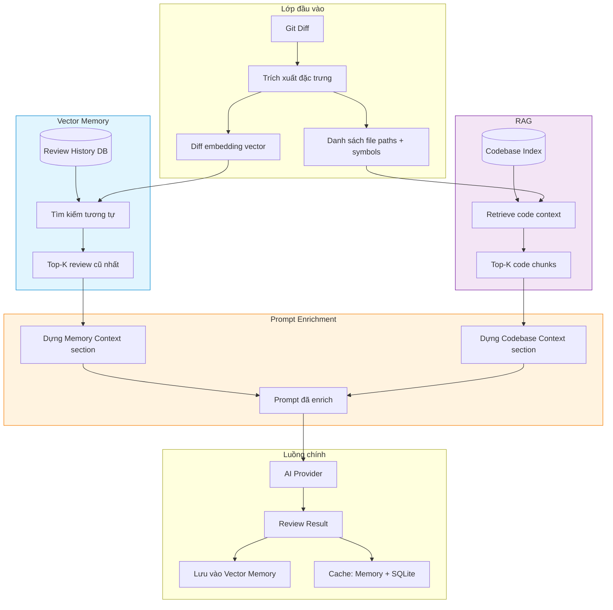
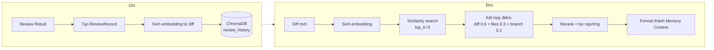
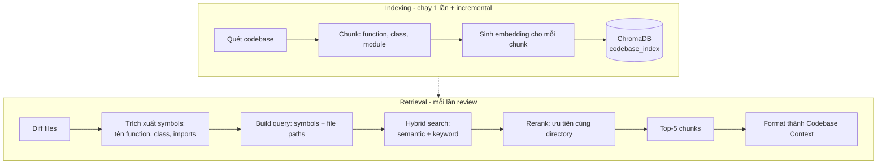
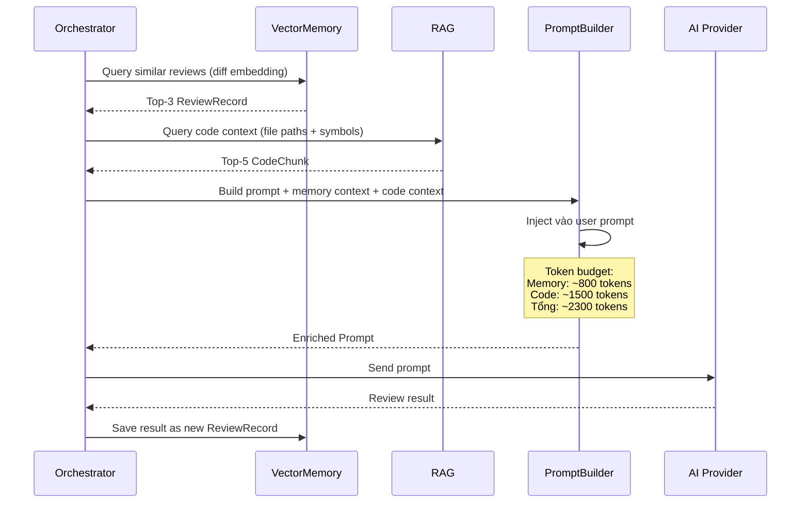
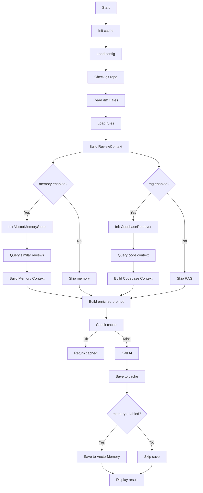

# 🧠 RAG + Vector Memory — Thiết kế Kiến trúc

> **Mục tiêu:** Enrich prompt cho AI code review bằng cách thêm context từ lịch sử review trước (Vector Memory) và từ codebase (RAG), giúp review chất lượng hơn, có tính kế thừa và hiểu sâu về dự án.

---

## 📊 Đánh giá Hiện tại

| Khía cạnh | Hiện tại | Vấn đề |
|-----------|----------|--------|
| Prompt context | Chỉ diff + file contents + rules | AI không biết lịch sử review, không biết cấu trúc codebase |
| Cache | SHA-256 của diff → exact match | Chỉ cache nếu diff giống hệt, không có "similar review" |
| Rules | `.roo/rules.md` tĩnh | Không tự động cập nhật từ codebase |
| AI context window | 8K tokens | Có thể dùng thêm ~2-3K tokens cho context bổ sung |

---

## 🏗️ Kiến trúc Tổng thể



### Giải thích luồng

1. **Input:** Git diff được trích xuất thành 2 thứ — vector embedding (để search) và danh sách file paths + symbols (để retrieve code context)
2. **Vector Memory:** Dùng embedding của diff để tìm top-K review cũ có changeset tương tự nhất
3. **RAG:** Dùng file paths + symbols để retrieve các đoạn code liên quan từ codebase index
4. **Prompt Enrichment:** Ghép memory context + codebase context vào user prompt trước khi gửi AI
5. **Core:** Sau khi AI trả kết quả, lưu vào cache (như hiện tại) + lưu vào vector memory (mới)

---

## 🧩 Module 1: Vector Memory

### Mục đích

Lưu lịch sử các lần review và cho phép tìm kiếm những review có changeset tương tự với diff hiện tại.

### Luồng hoạt động



### Dữ liệu lưu trữ

Mỗi record trong vector memory gồm:
- **ID:** UUID 12 ký tự
- **Thời gian:** Timestamp lúc review
- **Project:** Tên project
- **Branch:** Branch được review
- **Diff hash:** SHA-256 của diff (liên kết với cache)
- **Files:** Danh sách file thay đổi
- **Summary:** 500 ký tự đầu của review (tóm tắt)
- **Score:** Điểm tổng thể (nếu có)
- **Issue counts:** Số lượng critical/major issues
- **Embedding:** Vector 384 chiều

### Storage

- **Vector DB:** ChromaDB (local, persist to disk)
- **Path:** `.roo/memory/vector_db/` trong project root
- **Collection:** `review_history`
- **Embedding model:** `all-MiniLM-L6-v2` (384 dims, chạy local, ~80MB RAM)
- **Similarity metric:** Cosine similarity

### Chiến lược tìm kiếm

Kết hợp 3 yếu tố để tính điểm tương đồng:

| Yếu tố | Trọng số | Ý nghĩa |
|--------|:--------:|---------|
| Diff embedding similarity | 0.6 | Changeset giống nhau → vấn đề tương tự |
| File paths overlap (Jaccard) | 0.3 | Cùng file → context liên quan |
| Branch match | 0.1 | Cùng branch → cùng feature context |

**Quy trình:**
1. Fetch top_k * 2 từ ChromaDB bằng cosine similarity
2. Tính combined score cho từng kết quả
3. Lọc kết quả dưới ngưỡng min_score (0.5)
4. Sort và lấy top_k cuối cùng

### Embedding strategy

- Chỉ embed phần đầu diff (2000 ký tự) — đủ để capture file paths và loại thay đổi
- Thêm phần cuối diff (500 ký tự) nếu diff > 2500 ký tự
- Không embed toàn bộ diff (có thể rất lớn, gây lãng phí)

### Lazy loading

- Embedding model chỉ load lần đầu tiên cần dùng
- ChromaDB client chỉ init khi thực sự cần query/add
- Nếu thiếu dependency (chromadb, sentence-transformers) → graceful degradation, không crash

### Xử lý lỗi

- Mọi lỗi ChromaDB đều được catch và log warning
- Review vẫn chạy bình thường nếu vector memory lỗi
- Không có retry — fail fast, không làm chậm review

---

## 🧩 Module 2: RAG

### Mục đích

Index toàn bộ codebase thành các chunks nhỏ (function, class, module) và retrieve những chunks liên quan đến changeset hiện tại.

### Luồng hoạt động



### Chunking strategy

| Loại chunk | Kích thước | Overlap | Áp dụng cho |
|-----------|:----------:|:-------:|-------------|
| Function | Toàn bộ function | 0 | `def foo()` |
| Class | Toàn bộ class | 0 | `class Bar()` |
| Module header | 20 dòng đầu file | 0 | Imports + docstring |
| Large file section | 100 dòng | 20 dòng | File > 200 dòng |

Mỗi chunk lưu kèm metadata:
- File path (relative)
- Start/end line
- Loại chunk (function/class/module/section)
- Tên symbol (nếu có)
- Ngôn ngữ lập trình

### Retrieval strategy

**Hybrid search** — kết hợp 2 phương pháp:

1. **Semantic search:** Query = `" ".join(file_paths + symbols)` → cosine similarity trên embedding
2. **Keyword filter:** Boost điểm +0.2 nếu chunk cùng directory với changed files
3. **Rerank:** Ưu tiên chunks từ file đang được sửa → cùng package → function/class (hơn section)

### Incremental indexing

- **Full re-index:** `ai-review index` command
- **Incremental:** Khi review, nếu phát hiện file mới chưa index → tự động index
- **Cache:** Lưu `file_mtime` để biết file nào đã thay đổi

---

## 🔄 Prompt Enrichment

### Luồng enrichment



### Cấu trúc prompt mới

User prompt hiện tại có 6 sections. Sẽ thêm 2 sections mới:

**Section 7 — Memory Context** (chèn sau review instructions):
```
## 📜 Lịch sử Review Liên quan

Các review trước đây có changeset tương tự:

### Review #1 — 2 ngày trước — Branch: feature/auth
- Files: src/auth/login.py, src/auth/register.py
- Điểm: 7.2/10
- Vấn đề chính: Thiếu input validation, hardcoded secret
- Critical: 1 | Major: 3

### Review #2 — 1 ngày trước — Branch: fix/login-validation
- Files: src/auth/login.py
- Điểm: 8.5/10
- Ghi chú: Đã fix input validation, còn thiếu rate limiting
```

**Section 8 — Codebase Context** (chèn sau memory context):
```
## 📂 Codebase Context

Các đoạn code liên quan đến changeset:

### src/services/user.py:42-58 — Function: get_user
[code content]
*Được gọi bởi: api/users.py, admin/users.py*

### src/models/user.py:1-30 — Class: User
[code content]
*Đang được thêm field mới trong changeset này*
```

### Token budget management

| Section | Tokens | Ghi chú |
|---------|:------:|---------|
| System prompt | ~800 | Cố định |
| Project context | ~100 | Luôn có |
| Changed files | ~100 | Luôn có |
| Git diff | ~2000 | Truncated 12K chars |
| File contents | ~2000 | Truncated 6K chars/file |
| Review instructions | ~300 | Luôn có |
| **Memory context** | **~800** | **MỚI — top-3 reviews** |
| **Codebase context** | **~1500** | **MỚI — top-5 chunks** |
| **Tổng** | **~7600** | **Trong giới hạn 8192** |

**Fallback khi vượt ngưỡng:**
1. Giữ Memory context (quan trọng hơn — lịch sử review)
2. Giảm Codebase context xuống top-3 chunks
3. Nếu vẫn quá, bỏ Codebase context

---

## 🎮 CLI Flags & Config

### CLI flags mới

| Flag | Default | Mô tả |
|------|:-------:|-------|
| `--memory/--no-memory` | `--memory` | Bật/tắt vector memory |
| `--rag/--no-rag` | `--no-rag` | Bật/tắt RAG |
| `--reindex` | `false` | Force re-index codebase |

### New CLI command

```
ai-review index [--force]
```

Index toàn bộ codebase cho RAG. `--force` để re-index từ đầu.

### Env vars mới

| Variable | Default | Mô tả |
|----------|:-------:|-------|
| `VECTOR_MEMORY_ENABLED` | `true` | Bật/tắt vector memory |
| `RAG_ENABLED` | `false` | Bật/tắt RAG |
| `EMBEDDING_MODEL` | `all-MiniLM-L6-v2` | Tên embedding model |
| `VECTOR_DB_PATH` | `.roo/memory/vector_db` | Đường dẫn lưu vector DB |
| `MEMORY_TOP_K` | `3` | Số review cũ retrieve |
| `RAG_TOP_K` | `5` | Số code chunks retrieve |
| `RAG_CHUNK_SIZE` | `100` | Kích thước chunk (dòng) |
| `RAG_CHUNK_OVERLAP` | `20` | Overlap giữa các chunks |

### Cấu trúc Config mới

```
AppConfig (hiện tại)
├── api_key, model, base_url, ...
├── memory: MemoryConfig (mới)
│   ├── enabled: bool = true
│   ├── top_k: int = 3
│   └── db_path: str = ".roo/memory/vector_db"
├── rag: RAGConfig (mới)
│   ├── enabled: bool = false
│   ├── chunk_size: int = 100
│   ├── chunk_overlap: int = 20
│   └── top_k: int = 5
└── embedding_model: str = "all-MiniLM-L6-v2"
```

---

## 📁 Cấu trúc File

```
src/
├── memory/                          # MỚI — Vector Memory module
│   ├── __init__.py                  # Public API: get_memory_store()
│   ├── store.py                     # VectorMemoryStore — ChromaDB wrapper
│   ├── models.py                    # ReviewRecord, MemoryQuery dataclasses
│   └── embedder.py                  # Embedding generation (sentence-transformers)
├── rag/                             # MỚI — RAG module
│   ├── __init__.py                  # Public API
│   ├── indexer.py                   # CodebaseIndexer — scan + chunk + embed + store
│   ├── retriever.py                 # CodebaseRetriever — hybrid search
│   ├── chunker.py                   # CodeChunker — line-based + AST-aware chunking
│   └── models.py                    # CodeChunk, RetrievalQuery dataclasses
├── types.py                         # THÊM — MemoryConfig, RAGConfig
├── config.py                        # THÊM — Load memory/rag config từ env
├── commands/review.py               # SỬA — Inject memory retrieval + save
├── ai/prompt_builder.py             # SỬA — _build_memory_context(), _build_codebase_context()
└── index.py                         # SỬA — --memory/--rag flags + index command
```

---

## 🔄 Luồng Xử lý Mới (review.py)



### Chi tiết các bước mới trong review.py

**Bước 6b — Query vector memory** (sau khi build prompt, trước khi check cache):
- Nếu `memory.enabled`:
  - Init VectorMemoryStore (lazy)
  - Sinh embedding từ diff
  - Query top-K similar reviews
  - Nếu có kết quả → build Memory Context section → append vào user prompt

**Bước 6c — Query RAG** (song song với 6b):
- Nếu `rag.enabled`:
  - Init CodebaseRetriever (lazy)
  - Trích xuất symbols từ changed files
  - Hybrid search → top-K chunks
  - Build Codebase Context section → append vào user prompt

**Bước 10 — Save to vector memory** (sau khi lưu cache):
- Nếu `memory.enabled`:
  - Parse ReviewResult thành ReviewRecord
  - Sinh embedding từ diff
  - Lưu vào ChromaDB

---

## 📦 Dependencies

```toml
# Thêm vào pyproject.toml
chromadb>=0.5.0              # Vector database
sentence-transformers>=2.7.0 # Local embedding model
tree-sitter>=0.22.0          # AST parsing cho chunking (optional, chỉ cho RAG)
```

**Tổng dung lượng thêm:** ~100-150MB (chủ yếu từ sentence-transformers + model files)

---

## 🎯 Lộ trình Implement

### Phase 1: Vector Memory (làm trước — 9 steps)

| Step | File | Thay đổi |
|------|------|----------|
| 1 | [`src/memory/models.py`](src/memory/models.py) | MỚI — ReviewRecord, MemoryQuery, MemoryResult |
| 2 | [`src/memory/embedder.py`](src/memory/embedder.py) | MỚI — Embedder class (lazy-load, singleton) |
| 3 | [`src/memory/store.py`](src/memory/store.py) | MỚI — VectorMemoryStore (ChromaDB wrapper) |
| 4 | [`src/memory/__init__.py`](src/memory/__init__.py) | MỚI — Public API |
| 5 | [`src/types.py`](src/types.py) | THÊM — MemoryConfig, ReviewRecord types |
| 6 | [`src/config.py`](src/config.py) | SỬA — Load memory config từ env |
| 7 | [`src/commands/review.py`](src/commands/review.py) | SỬA — Inject memory retrieval + save |
| 8 | [`src/ai/prompt_builder.py`](src/ai/prompt_builder.py) | SỬA — _build_memory_context() section |
| 9 | [`src/index.py`](src/index.py) | SỬA — --memory/--no-memory flag |

### Phase 2: RAG (làm sau — 10 steps)

| Step | File | Thay đổi |
|------|------|----------|
| 1 | [`src/rag/models.py`](src/rag/models.py) | MỚI — CodeChunk, RetrievalQuery |
| 2 | [`src/rag/chunker.py`](src/rag/chunker.py) | MỚI — CodeChunker |
| 3 | [`src/rag/indexer.py`](src/rag/indexer.py) | MỚI — CodebaseIndexer |
| 4 | [`src/rag/retriever.py`](src/rag/retriever.py) | MỚI — CodebaseRetriever |
| 5 | [`src/rag/__init__.py`](src/rag/__init__.py) | MỚI — Public API |
| 6 | [`src/types.py`](src/types.py) | THÊM — RAGConfig |
| 7 | [`src/config.py`](src/config.py) | SỬA — Load RAG config |
| 8 | [`src/commands/review.py`](src/commands/review.py) | SỬA — Inject RAG retrieval |
| 9 | [`src/ai/prompt_builder.py`](src/ai/prompt_builder.py) | SỬA — _build_codebase_context() |
| 10 | [`src/index.py`](src/index.py) | SỬA — index command + --rag flag |

---

## ✅ Acceptance Criteria

### Vector Memory
- [ ] Lưu review result vào ChromaDB sau mỗi lần review thành công
- [ ] Retrieve top-3 reviews tương tự dựa trên diff embedding
- [ ] Inject memory context vào prompt (tối đa ~800 tokens)
- [ ] `--no-memory` flag tắt hoàn toàn
- [ ] Dữ liệu persist giữa các lần chạy
- [ ] Graceful degradation nếu thiếu dependency hoặc ChromaDB lỗi

### RAG
- [ ] `ai-review index` command index toàn bộ codebase
- [ ] Incremental indexing — chỉ re-index file đã thay đổi
- [ ] Retrieve top-5 code chunks liên quan đến changeset
- [ ] Hybrid search: semantic + keyword
- [ ] Inject codebase context vào prompt (tối đa ~1500 tokens)
- [ ] `--rag/--no-rag` flag

### Chung
- [ ] Tổng prompt tokens không vượt quá 8192 (có fallback)
- [ ] Không làm chậm đáng kể thời gian review (< 500ms overhead cho cả 2 module)
- [ ] Tương thích với cache hiện tại (SHA-256 diff hash)
- [ ] Graceful degradation — mọi lỗi đều được catch, review vẫn chạy
